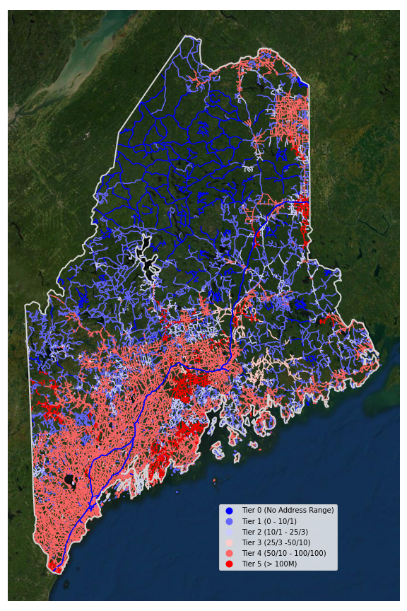
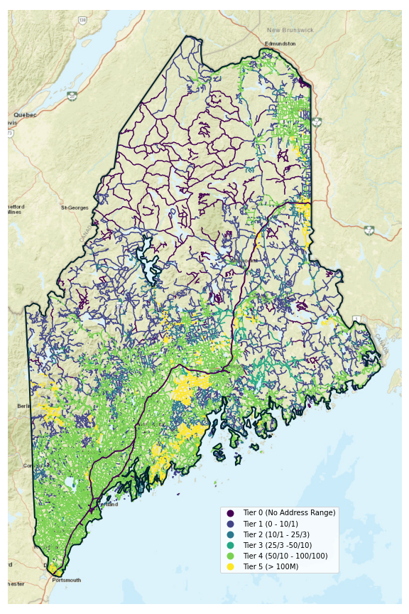
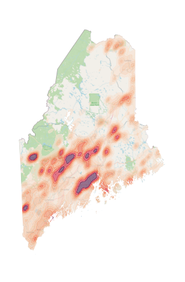
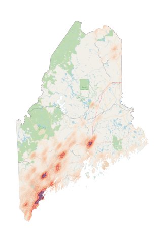
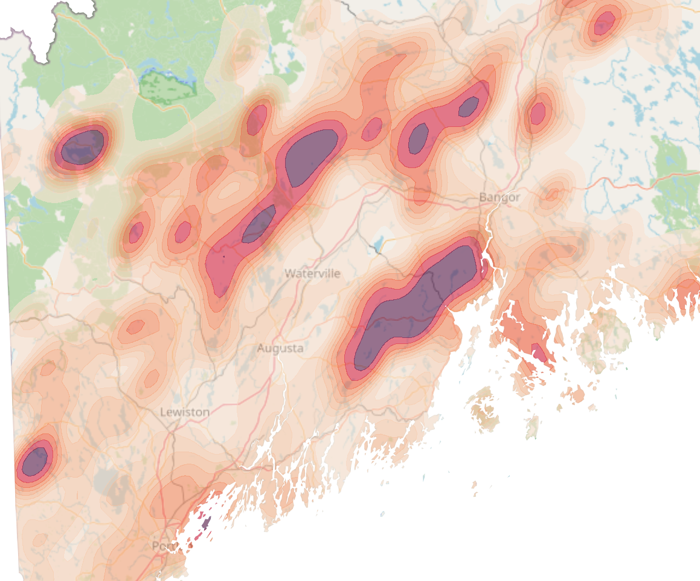
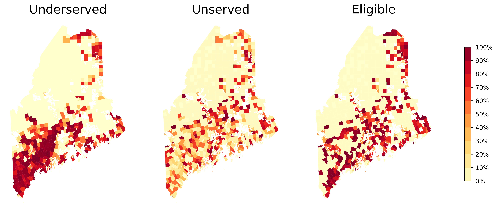
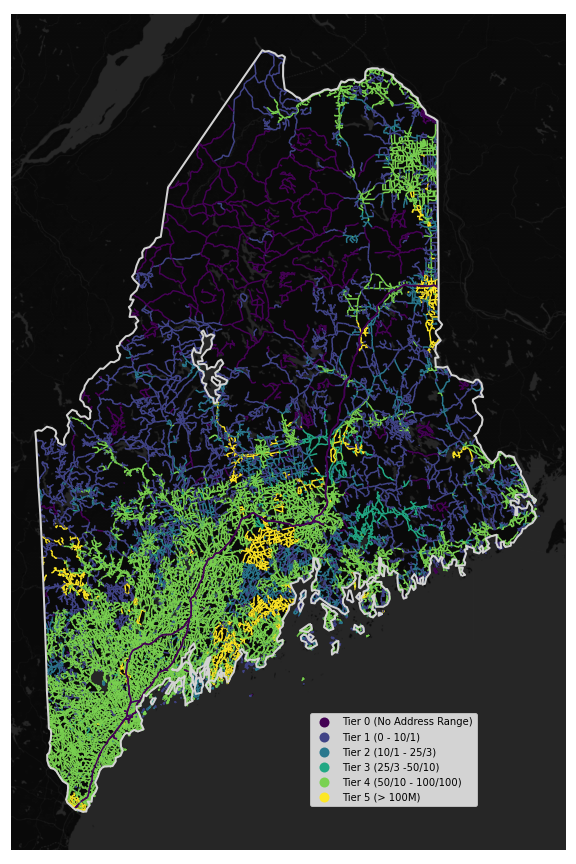

# Assignment 7
Satellite | WorldStreetMap | Heatmap
:-------------------------:|:-------------------------:|:----:|
 |  |   

This repository contains my EDA and figures of the subscribers and tiers provided by Maine Connectivity Authority. The scope of this project limits us to only representing the data we've been given by MCA, and drawing connections within that data. This means that we wouldn't want to try diving into the demographics or economic factors that correlate underserved or unserved subscribers, for example.

When reviewing the data, I saw two factors that could be explored within the given data:
1. Concentrated areas of underserved people
2. Distribution of internet speeds

For each of these factors, I identified a plotting technique, transformed the data to fit the method and then worked extensively to format the plots to best convey the data.

> ### Note on Reproducing Results
> Python files are in `src/`  
> Each of the plots in this repository can be created with one of the python files, and I have saved all the parameters in the file so many variations could be tried. 

## Distribution of Unserved and Undersevered Subscribers
Universal high-speed internet access is the goal of the MCA and one useful tactic for this effort is to identify high-impact areas. We can't tell from this data alone how feasible improvements would be in a given area, but we can show where the most improvement is needed. 

This means that I should show were unserved and underserved customers are concentrated. There are roughly 70k unserved subscriber locations in the data, and 400k+ 'underserved' subscribers as well. With the limitations of our techniques, I think that the best way to represent this data is to plot the density of points in a kdeplot.  
### KDE Plots
> #### Instructions to Reproduce
> 1. run `src/subscriber_heatmap.py`  
> 2. images will be saved in `img/heatmap/`  
> ### *Note: plots will take ~15 min. to complete*

| Unserved | Underserved |
|:---:|:---:|
|  | |  

The code that produces these plots is in `subscriber_heatmap.py`  
The critical factors I found while making these plots were a sensible colormap and a reasonable bandwidth for the kernel density estimate. The colormap had to convey that the areas of high density were undesirable, which from my design perspective meant that they should be the kind of color you would see on a warning sign.

The bandwidth parameter scipy's kernel density estimate function determines how far the density of a single data point is spread across the distribution, i.e., a high bandwidth would smooth the curve whereas a low bandwidth would maintain the irregularities in the distribuation.  
From a design perspective, the plots need to be able to show a tight contour around the areas of very high concentration while smoothing over the the peaks in lower concentrations.

The data is much more meaningful when plotted over a basemap that gives context for the areas of high concentration. The unserved populations are highly concentrated away from population centers, whereas underserved are concentrated in the larger cities.

The limitations of these plots is that they don't have a defined density, like subscribers/sq.mi. Between the two plots, the relative density is different as well, where the density of a given color in each graph is not equal. So you can't look at the two plots above and judge the density of underserved and unserved in a given area.

### Notes on `subscriber_heatmap.py`
Because there are so many points, the runtime of the plotting is very long:
* Unserved ~ 90 sec.
* Underserved ~11 min.  

As a result, I've limited iterations in tweaking the parameters.  
The output includes 100dpi, 300ddpi, 600dpi and svg images.

## Eligible Areas
> #### Instructions to Reproduce
> 1. run `src/eligible_areas.py`  
> 2. images will be saved in `img/eligible_areas/`  

These shapes provide the very useful estimate of unserved and underserved as a percentage of population, which is very useful for identifying areas that have a high share of unserved/underserved but a low populations density.

These plots are produced with `eligible_areas.py`    

## Distribution of Internet Speeds
> #### Instructions to Reproduce
> 1. run `src/tier_plot.py`  
> 2. images will be saved in `img/tiers/` 

  

This is where I spent the most time in tweaking the visual parameters and presentation of the data. 
I tried the following, and didn't like the results:
* including county lines
* using different basemaps
* different color maps
* marking major cities on the map

The coolwarm and viridis color maps do the best of describing the quality of the broadband networks in all areas. The coolwarm or bwr color maps show speed like a heat map, with traditional hot and cold colors. The challenge here is that highspeed networks are red and red usually connotes bad. My favorite is viridis, because it shows the higher speeds with higher luminance. I think it's especially easy to read on a black background.

Satellite | WorldStreetMap | Dark
:-------------------------:|:-------------------------:|:----:|
 |  |   

### Notes on `tier_plot.py`
The plotting doesn't take as long with these, so I used a more iterative approach to find the parameters that met my needs. I added a looping function to try combinations from a list of parameters, including lineweight, colormap, basemap, whether to label the cities.

I've included some of 200+ the discarded versions in the `img/testing/`.

